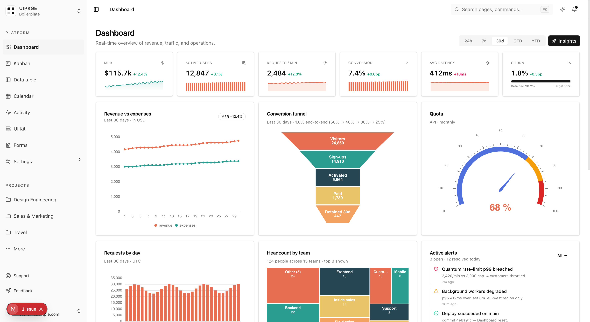
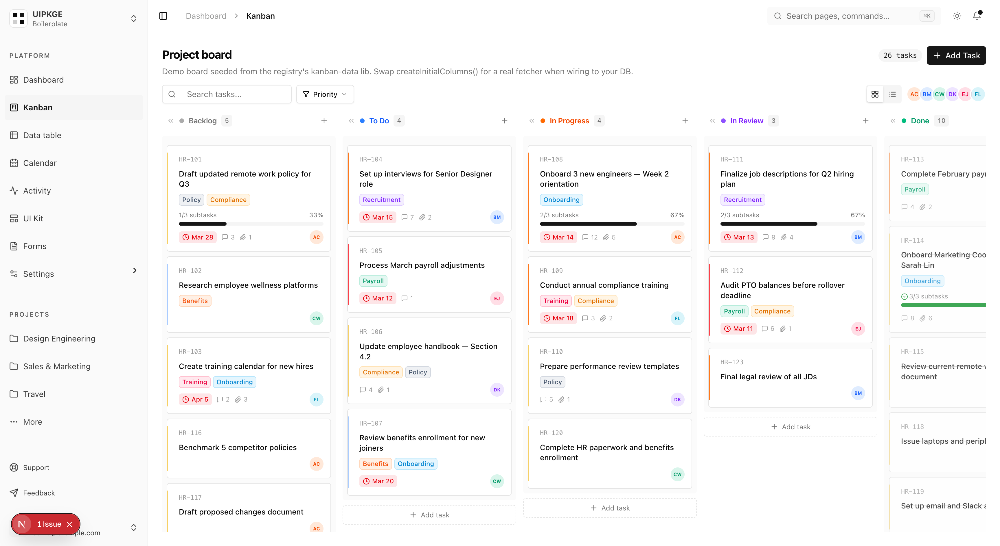
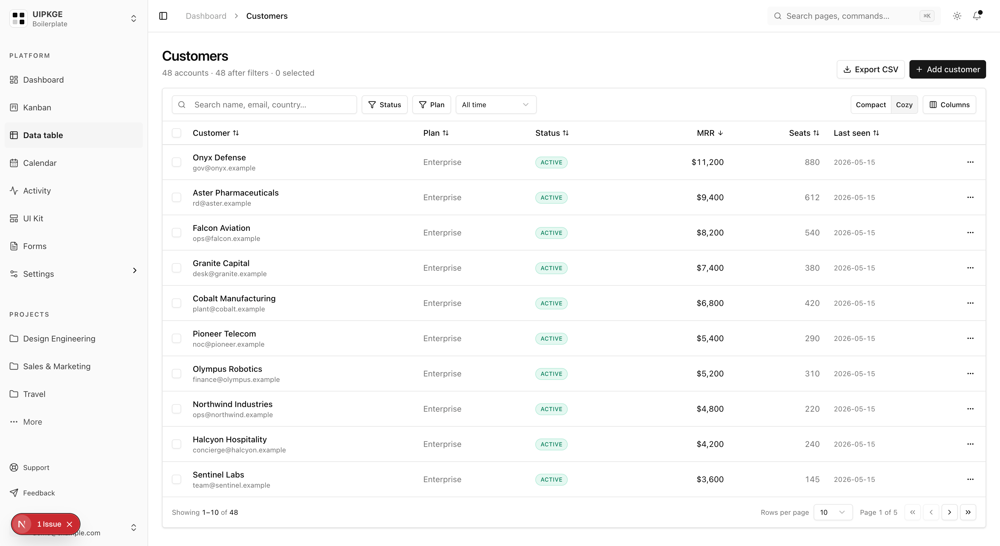
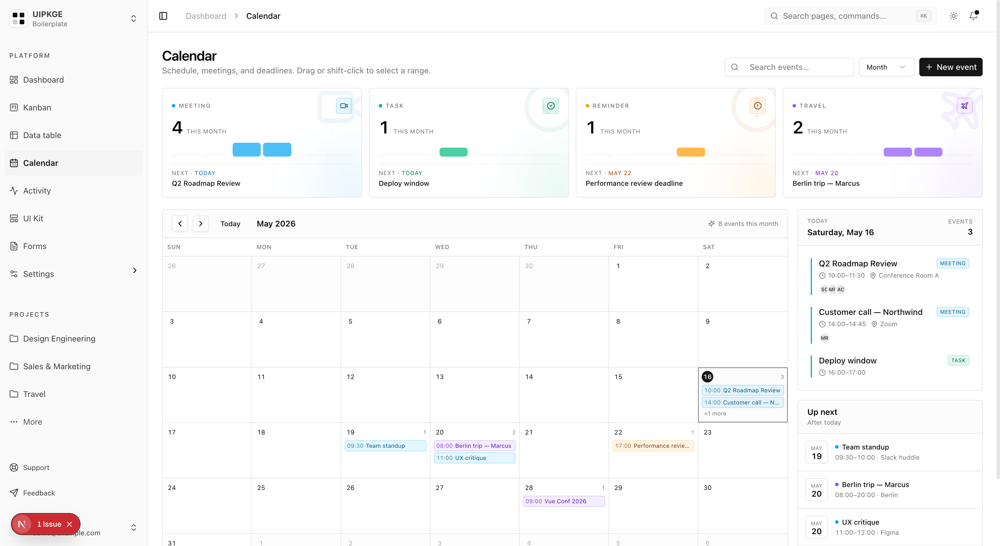
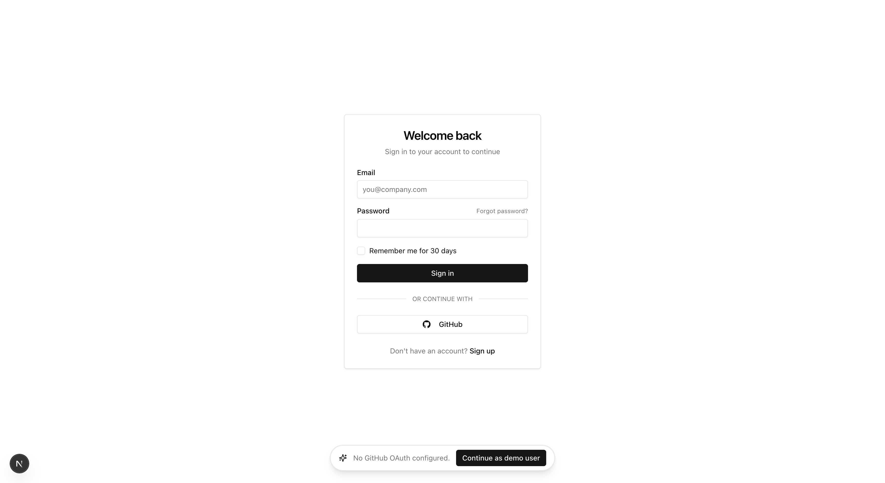

# Next.js 16 SaaS Boilerplate — React 19, TypeScript, Tailwind CSS 4

[](./LICENSE)


A production-grade **Next.js 16 SaaS boilerplate / starter kit** (App Router) with **React 19, TypeScript and Tailwind CSS 4**, built on the shadcn/ui-compatible [**`@uipkge-react`**](https://uipkge.dev/react/components) UI registry. It ships GitHub OAuth + magic-link authentication, Polar billing, a Drizzle ORM + Postgres schema, an admin area with role-based access control (RBAC), team invites, API keys, an audit log, i18n with next-intl, and a full dashboard (charts, kanban, data table, calendar). **Every external integration is gated on env**, so a fresh clone runs in demo mode with no database, OAuth app or API keys.

**[Live demo](https://next-boilerplate-sooty.vercel.app/login)** · **[Vue/Nuxt sibling: nuxt-boilerplate](https://github.com/uday-a/nuxt-boilerplate)** · **[UI registry: uipkge.dev](https://uipkge.dev)**

- **Auth:** GitHub OAuth, passwordless magic links, demo sign-in, encrypted `iron-session` cookies, team invites by token
- **Billing:** Polar checkout, customer portal and signature-verified subscription webhooks
- **Database:** Drizzle ORM + Postgres — users, projects, subscriptions, API keys, audit log, invites
- **Admin & RBAC:** `admin` / `editor` / `user` roles enforced server-side, admin user list, permission-matrix UI
- **Dashboard:** KPIs, ECharts charts, Leaflet map, kanban, TanStack data table, calendar, messages, activity heatmap
- **i18n:** next-intl (English + Spanish), cookie-based locale, optional over-the-air translations
- **DX:** zod-validated env, typed API envelope, structured logging, Vitest + Playwright, one-click Vercel deploy



<details>
<summary><b>More screenshots — 5 pages</b></summary>

### Kanban board (`/dashboard/kanban`)



### Data table (`/dashboard/data-table`)



### Calendar (`/dashboard/calendar`)



### Public landing (`/`)


### Sign-in (`/login` — demo mode active)



</details>

> ### Powered by [UIPKGE](https://uipkge.dev)
>
> Every UI element, block and chart in this repo comes from the **`@uipkge-react`** registry — a shadcn/ui-compatible React distribution that covers the whole shape of a SaaS app:
>
> - **Auth UI** — sign-in, sign-up, magic link, forgot password, MFA code entry, invite acceptance, onboarding stepper
> - **Marketing UI** — header, hero, logos, features, bento grid, testimonials, pricing, FAQ, CTA, contact, footer
> - **Dashboard UI** — collapsible sidebar, breadcrumbs, command palette, notifications popover, theme customizer, locale switcher, kanban, data table, calendar
> - **Charts** — area, bar, line, funnel, gauge, treemap, calendar heatmap, sparkline (ECharts via `echarts-for-react`, themed for light + dark)
> - **Forms + tables** — React Hook Form + zod fields, TanStack Table data grids
> - **Rich text** — Tiptap editor with links, placeholders, task lists, text-align, underline
> - **Elements** — button, dialog, sheet, command, popover, tooltip, context menu, date/range calendar, pin input, file upload, slider, …
>
> Same design tokens, same theming, same Tailwind CSS 4 setup. One CLI command:
>
> ```bash
> npx shadcn@latest add @uipkge-react/<name> -y
> ```
>
> The source is copied into your project — fully owned, fully editable, no runtime dependency. [Browse the React catalog →](https://uipkge.dev/react/components) · [Jump to the UIPKGE section ↓](#uipkge-ui-registry)

---

## Quick start

```bash
git clone https://github.com/uday-a/next-boilerplate my-app
cd my-app
npm install
echo "AUTH_SECRET=$(openssl rand -base64 32)" > .env
npm run dev
# → http://localhost:3000
# → http://localhost:3000/login  (Continue as demo user)
```

Demo mode is **on by default in local development only** (`next dev`), so `/login` shows **Continue as demo user** with no further config. Every deployment — production *and* Vercel preview — is **opt-in**: set `DEMO_MODE=true` / `NEXT_PUBLIC_DEMO_MODE=true` to enable it (e.g. for a public live demo), or `false` to force it off. Demo sessions are **admin**, so only enable it where that's intended.

### Routes

| Area | Path | Notes |
|------|------|-------|
| Landing | `/` | Marketing blocks; header/hero/CTA adapt when signed in |
| Pricing | `/pricing` | Plan cards → Polar checkout |
| Terms / Privacy | `/terms`, `/privacy` | Legal page shells |
| Sign in | `/login` | GitHub OAuth, magic-link form, demo sign-in bar |
| Sign up | `/sign-up` | GitHub OAuth (other providers in the block are disabled) |
| Forgot password | `/forgot-password` | Sends a magic link (no password auth) |
| MFA | `/mfa` | 6-digit code UI — **mock only**, not enforced |
| Invite | `/invite/[token]` | Verify + accept a team invite |
| Onboarding | `/onboarding` | 3-step stepper (profile → workspace → invite) — UI only |
| Dashboard | `/dashboard` | KPIs, charts, Leaflet map, date-range filter |
| Messages | `/dashboard/messages` | Inbox / thread UI |
| Kanban | `/dashboard/kanban` | Registry kanban board |
| Customers | `/dashboard/data-table` | TanStack Table (sort, filter, paginate) |
| Calendar | `/dashboard/calendar` | Month grid, context menus, event dialog |
| Activity | `/dashboard/activity` | Activity heatmap + month grid |
| Locations | `/dashboard/locations` | Office directory with filters and local times |
| UI kit | `/dashboard/ui-kit` | Every installed primitive on one page |
| Forms | `/dashboard/forms`, `/dashboard/form-example` | Form controls + zod / React Hook Form reference |
| Projects | `/projects`, `/projects/[slug]` | CRUD backed by `/api/projects` |
| Feedback / Support | `/feedback`, `/support` | Feedback form (emails ops) + help center |
| Settings | `/settings/*` | general, account, security, notifications, billing, team, api-keys, activity, integrations, limits |
| Admin | `/admin/users`, `/admin/roles` | Admin-only user list, RBAC permission matrix |

All dashboard, settings, projects, feedback, support, onboarding and admin routes are protected by `proxy.ts`, which redirects to `/login?next=…`.

---

## Features

### Developer experience

- **Next.js 16** App Router + **React 19** + **TypeScript**
- **Turbopack** dev server (`next dev --turbopack`)
- **zod-validated env** at boot (`lib/env.ts`) — invalid or half-configured integrations (e.g. Polar token without webhook secret, Axiom token without dataset) fail loud
- **`components.json`** pre-wired for the `@uipkge-react` registry
- **`npm run bootstrap:registry`** — refresh installed registry items from a sibling `uipkge-ui` checkout
- **ESLint 9** (`eslint-config-next`), **Vitest** unit tests, **Playwright** end-to-end tests

### Frontend

- **Tailwind CSS 4** with UIPKGE OKLCH design tokens (`app/globals.css`)
- **Dark mode** — light / dark / system via `next-themes`
- **Theme customizer** — 14 accent color themes (`lib/color-themes.ts`)
- **Command palette** — ⌘K / Ctrl K (`cmdk`)
- **Notifications popover**, breadcrumbs, collapsible sidebar, demo-data banners
- **Radix UI** primitives, **lucide-react** icons, **sonner** toasts
- **TanStack Table**, **React Hook Form** + zod, **ECharts**, **Tiptap**, **Leaflet**

### Backend (Route Handlers)

- **Typed API envelope** — routes return `{ ok: true, data }` or `{ ok: false, error: { code, message, details? } }` (`lib/api/response.ts`)
- **Structured error codes** — `UNAUTHORIZED`, `SESSION_INVALID`, `FORBIDDEN`, `NOT_FOUND`, `VALIDATION_FAILED`, `RATE_LIMITED`, `INTERNAL`
- **`requireAuth()` / `requireRole()`** guards (`server/utils/guards.ts`)
- **Rate limiting** — in-memory sliding window per IP on demo sign-in, magic link, team invites and API-key creation (`server/utils/rate-limit.ts`)
- **Audit log** — append-only `audit_logs` table written by `recordAudit()` for API-key and invite events; surfaced at `/settings/activity`
- **API keys** — create / list / revoke at `/settings/api-keys`; SHA-256 hashed, shown once, prefixed `uipkge_`, scoped. A `verifyApiKey()` helper is included but not yet wired into any route
- **Structured logger** — dot-namespaced events to stdout, optional Axiom shipping
- **Open-redirect-safe** `?next=` handling after sign-in (`lib/auth/redirect.ts`)

## Authentication

- **GitHub OAuth** — `GET /api/auth/github` + `/api/auth/github/callback` (GitHub is the only wired OAuth provider)
- **Magic link** — `POST /api/auth/magic-link` emails a single-use, hashed, expiring token; `GET` verifies it. Needs `DATABASE_URL` (Resend optional — the link is logged to stdout without it)
- **Demo sign-in** — `POST /api/auth/demo` mints a demo-user session; `/login` shows **Continue as demo user**
- **Sessions** — `iron-session` encrypted cookies (`AUTH_SECRET`)
- **Route protection** — `proxy.ts` gates protected prefixes
- **Team invites** — admins/editors invite by email + role; hashed token, 7-day TTL, single-use, accepted at `/invite/[token]`
- **Admin bootstrap** — `INITIAL_ADMIN_LOGINS` lists GitHub usernames that get `role='admin'` on sign-in

> The Nuxt sibling wires 44 OAuth providers; this repo currently wires GitHub only. MFA and the onboarding stepper are UI screens, not enforced flows.

## Admin & RBAC

- `user_role` Postgres enum: `user`, `admin`, `editor`
- Server-side enforcement with `requireRole('admin', …)` — e.g. `/api/admin/users` (admin only), team invites (admin or editor)
- `/admin/users` — admin user list
- `/admin/roles` — permission-matrix UI (owner / admin / editor / viewer / billing) backed by mock data, session-only

## Database

- **Drizzle ORM** + **`postgres`** driver, lazy singleton (`server/db/index.ts`)
- Works with Neon, Supabase (pooler), Railway, RDS or local Postgres
- Schema (`server/db/schema.ts`): `users`, `projects`, `subscriptions`, `magic_link_tokens`, `api_keys`, `audit_logs`, `invites`
- Migrations in `server/db/migrations` — `npm run db:generate` / `npm run db:migrate`
- Without `DATABASE_URL`, demo sessions and GitHub sign-in still work; demo sessions get sample projects, API keys and team members instead of DB rows

## Billing

Polar.sh (`@polar-sh/sdk`):

- **Checkout** — `POST /api/billing/checkout` (Pro / Team / Enterprise product IDs)
- **Customer portal** — `POST /api/billing/portal`
- **Subscription status** — `GET /api/me/subscription`, shown at `/settings/billing`
- **Webhook** — `POST /api/webhooks/polar`, signature-verified, upserts `subscription.*` events

## Email

Resend: magic-link, team-invite and feedback emails (`server/utils/mailer.ts`). Without `RESEND_API_KEY`, emails are logged to stdout. Feedback goes to `EMAIL_OPS` (falls back to `EMAIL_FROM`).

## i18n

- **next-intl** with English and Spanish (`messages/en.json`, `messages/es.json`)
- Single-URL strategy — locale stored in the `uipkge-locale` cookie, no locale-prefixed routes; switch via the locale switcher
- **Over-the-air translations (optional)** — set `I18NOW_PROJECT_ID` (+ `I18NOW_API_KEY`) and published CDN translations merge over the local files

## Observability & analytics

- **Axiom** — structured log shipping when `AXIOM_TOKEN` + `AXIOM_DATASET` are set
- **PostHog** — client analytics with page-view capture when `NEXT_PUBLIC_POSTHOG_KEY` is set
- **Sentry** — env vars are validated in `lib/env.ts`, but the Sentry SDK is **not installed or wired** yet

---

## UIPKGE UI registry

This boilerplate is wired to the [**`@uipkge-react`**](https://uipkge.dev/react/setup) registry. Items install with the standard shadcn CLI and land under `components/` — fully owned, fully editable.

```bash
npx shadcn@latest add @uipkge-react/button -y
npx shadcn@latest add @uipkge-react/kanban-board -y
```

Already configured in [`components.json`](./components.json):

```json
{
  "registries": {
    "@uipkge-react": "https://uipkge.dev/r/react/{name}.json"
  }
}
```

Browse the catalog at **[uipkge.dev/react/components](https://uipkge.dev/react/components)** · the Vue sibling uses **`@uipkge`** at [uipkge.dev/vue/components](https://uipkge.dev/vue/components).

---

## Tech stack

| Layer | Library |
|---|---|
| Framework | [Next.js 16](https://nextjs.org) (App Router, Turbopack), [React 19](https://react.dev), TypeScript |
| Auth | [iron-session](https://github.com/vvo/iron-session) + GitHub OAuth + magic links |
| ORM / DB | [Drizzle ORM](https://orm.drizzle.team) + [postgres](https://github.com/porsager/postgres) |
| Styling | [Tailwind CSS 4](https://tailwindcss.com), [next-themes](https://github.com/pacocoursey/next-themes) |
| Components | shadcn/ui-compatible [`@uipkge-react`](https://uipkge.dev) on [Radix UI](https://www.radix-ui.com) |
| Tables | [TanStack Table](https://tanstack.com/table) |
| Forms | [React Hook Form](https://react-hook-form.com) + [Zod](https://zod.dev) |
| Editor | [Tiptap](https://tiptap.dev) |
| Charts | [ECharts](https://echarts.apache.org) via echarts-for-react |
| Maps | [Leaflet](https://leafletjs.com) |
| i18n | [next-intl](https://next-intl.dev) |
| Icons | [lucide-react](https://lucide.dev) |
| Billing | [Polar.sh](https://polar.sh) |
| Email | [Resend](https://resend.com) |
| Logs / analytics | [Axiom](https://axiom.co), [PostHog](https://posthog.com) |
| Testing | [Vitest](https://vitest.dev), [Testing Library](https://testing-library.com), [Playwright](https://playwright.dev) |

---

## Requirements

- **Node 22+** (`engines` in `package.json`, `.nvmrc`)
- **npm** (lockfile is `package-lock.json`)
- *Optional:* a Postgres URL — needed for persistence, magic links and team invites

---

## Getting started

### 1. Clone + install

```bash
git clone https://github.com/uday-a/next-boilerplate my-app
cd my-app
npm install
```

### 2. Environment

```bash
cp .env.example .env
# then set AUTH_SECRET in .env to the output of:
openssl rand -base64 32
```

Only `AUTH_SECRET` is required (32+ chars). Everything else is optional — see the matrix below.

### 3. Database (optional)

```bash
# Set DATABASE_URL in .env first, then:
npm run db:migrate
```

### 4. Run

```bash
npm run dev        # http://localhost:3000
npm run build      # production build
npm run start      # serve production build
```

Open **[http://localhost:3000/login](http://localhost:3000/login)** → **Continue as demo user**.

---

## Project structure

```
.
├── app/
│   ├── (marketing)/          # landing, pricing, legal, login, sign-up, forgot-password, mfa, invite, onboarding
│   ├── (dashboard)/          # sidebar shell: dashboard/*, projects, settings/*, admin/*, feedback, support
│   └── api/                  # Route Handlers: auth, me, projects, keys, team, activity, admin, billing, webhooks, feedback
├── components/
│   ├── blocks/               # @uipkge-react blocks (Header01, Hero01, CommandPalette, kanban-board, …)
│   └── ui/                   # primitives + charts + leaflet-map
├── i18n/request.ts           # next-intl request config (cookie locale + OTA merge)
├── messages/                 # en.json, es.json
├── lib/                      # env, api/response, auth, demo-mode, i18n, demo data, hooks
├── server/
│   ├── db/                   # Drizzle schema + migrations
│   └── utils/                # guards, audit, api-keys, rate-limit, logger, mailer, polar, tokens, i18now
├── e2e/                      # Playwright specs
├── scripts/                  # registry bootstrap, locale converter
├── proxy.ts                  # auth gate → /login?next=…
├── components.json           # shadcn CLI + @uipkge-react registry
└── .env.example
```

---

## Graceful degradation matrix

| Env var(s) | Unset | Set |
|---|---|---|
| `AUTH_SECRET` | **Boot fails** — required (32+ chars) | Sessions encrypted |
| `DEMO_MODE` / `NEXT_PUBLIC_DEMO_MODE` | Auto: on in `next dev` only; off in every deployment (production and preview) | `true` enables demo sign-in (admin session) — required for a public live demo; `false` forces it off |
| `GITHUB_CLIENT_ID` + `GITHUB_CLIENT_SECRET` | GitHub sign-in unavailable | GitHub OAuth |
| `INITIAL_ADMIN_LOGINS` | Nobody auto-promoted | Listed GitHub logins become admins |
| `DATABASE_URL` | Demo sessions use sample data; magic links, invites and persistence unavailable | Drizzle persistence |
| `RESEND_API_KEY` + `EMAIL_FROM` / `EMAIL_OPS` | Emails logged to stdout | Real delivery |
| `POLAR_ACCESS_TOKEN` + `POLAR_WEBHOOK_SECRET` (+ `POLAR_*_PRODUCT_ID`, `POLAR_SERVER`) | Billing routes return an instructive error | Checkout, portal, webhooks |
| `I18NOW_PROJECT_ID` + `I18NOW_API_KEY` | Local `messages/*.json` only | CDN translations merged over local |
| `AXIOM_TOKEN` + `AXIOM_DATASET` | Logs to stdout only | Logs shipped to Axiom |
| `NEXT_PUBLIC_POSTHOG_KEY` | No analytics | PostHog page views |
| `NEXT_PUBLIC_SENTRY_DSN` (+ `SENTRY_*`) | — | Validated only; SDK not wired |
| `NEXT_PUBLIC_SITE_URL` | `http://localhost:3000` | OAuth redirects + email links |

---

## API conventions

```ts
// app/api/projects/route.ts (simplified)
export async function GET() {
  return apiHandler(async () => {
    const session = await requireAuth()
    return { projects: await listProjects(session.user.id) }
  })
}
```

```ts
// success
{ ok: true, data: T }
// failure
{ ok: false, error: { code, message, details? } }
```

---

## Testing

```bash
npm test             # Vitest unit tests (lib/*.test.ts, component tests)
npm run test:watch   # Vitest watch mode
npm run test:e2e     # Playwright: landing, auth flow, dashboard (starts `next dev` on :3005 unless BASE_URL is set)
npm run lint         # ESLint
```

---

## Deployment

> [!WARNING]
> **`DEMO_MODE` — demo sign-in creates an ADMIN session.** Demo mode is auto-on **only in local development** (`next dev`). Every deployment — production *and* preview — has it **off** unless you set `DEMO_MODE=true` (and `NEXT_PUBLIC_DEMO_MODE=true`) explicitly. Set it only on a deployment meant to offer a public demo; otherwise leave it unset or `false`.

### Vercel

Generate a session secret, then click:

```bash
openssl rand -base64 32
```

[](https://vercel.com/new/clone?repository-url=https://github.com/uday-a/next-boilerplate&env=AUTH_SECRET,DEMO_MODE,NEXT_PUBLIC_DEMO_MODE&envDescription=AUTH_SECRET%3A%20openssl%20rand%20-base64%2032.%20Set%20DEMO_MODE%20and%20NEXT_PUBLIC_DEMO_MODE%20to%20true%20only%20for%20a%20public%20demo%20(demo%20sessions%20are%20admin).&project-name=next-boilerplate&repository-name=next-boilerplate)

| Variable | Required | Value |
|----------|----------|-------|
| `AUTH_SECRET` | **Yes** | output of `openssl rand -base64 32` |
| `DEMO_MODE` | Only for a public demo (admin sessions) | `true` — otherwise leave unset or `false` |
| `NEXT_PUBLIC_DEMO_MODE` | Only for a public demo | `true` — otherwise leave unset or `false` |
| `NEXT_PUBLIC_SITE_URL` | After first deploy | `https://your-app.vercel.app` |

If you set `DEMO_MODE=true`, open **`https://<your-app>.vercel.app/login`** and click **Continue as demo user**.

### Production checklist

- [ ] Generate a fresh `AUTH_SECRET` (never reuse dev).
- [ ] Set `NEXT_PUBLIC_SITE_URL` to your real domain.
- [ ] Leave `DEMO_MODE` / `NEXT_PUBLIC_DEMO_MODE` unset or `false` (demo sign-in is an admin session).
- [ ] Register the OAuth callback: `https://<host>/api/auth/github/callback`.
- [ ] Register the Polar webhook: `https://<host>/api/webhooks/polar`.
- [ ] Run `npm run db:migrate` against the production `DATABASE_URL`.
- [ ] Note: rate limits are in-memory per instance — swap in a shared store if you need global limits.

---

## Parity with [nuxt-boilerplate](https://github.com/uday-a/nuxt-boilerplate)

This is the React/Next.js sibling of the Nuxt 4 SaaS starter: same registry-driven UI (`@uipkge-react` vs `@uipkge`), same demo sign-in on `/login`, same API envelope, same dashboard routes and translations.

| | Nuxt | Next.js (this repo) |
|---|---|---|
| Registry CLI | `npx shadcn-vue add @uipkge/<name>` | `npx shadcn@latest add @uipkge-react/<name>` |
| Session | `nuxt-auth-utils` | `iron-session` |
| OAuth | 44 providers | GitHub |
| i18n | `@nuxtjs/i18n` | `next-intl` |
| Demo sign-in | `POST /auth/demo` | `POST /api/auth/demo` |

Not ported yet: the multi-provider OAuth catalog, the onboarding tour, Sentry wiring, and the Nuxt SEO module setup.

---

## Contributing

PRs welcome. For non-trivial changes, open an issue first.

## License

MIT — see [LICENSE](./LICENSE).

## Acknowledgments

- [Next.js](https://nextjs.org) team
- [shadcn/ui](https://ui.shadcn.com) + [UIPKGE](https://uipkge.dev) for the component system
- [nuxt-boilerplate](https://github.com/uday-a/nuxt-boilerplate) — the Vue sibling this repo mirrors
- [Drizzle](https://orm.drizzle.team) for the ORM
